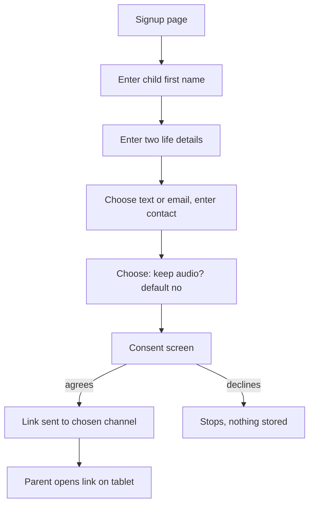
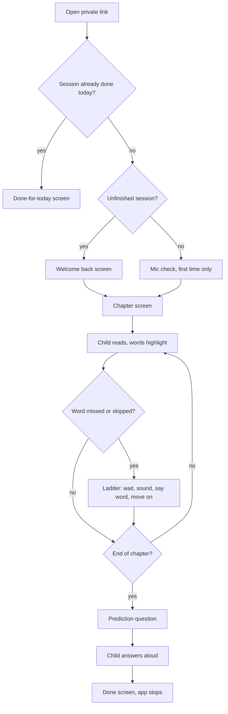
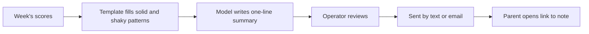

# Primer MVP: UX Flows and Screens

2026-10-09 · Nishi · Status: draft, decisions resolved · Builds on [02-prd.md](02-prd.md)

Screens are ASCII sketches for an iPad in landscape. They show layout and states, not final visuals. Design decisions UX1 to UX4 were settled on 2026-10-09 and are listed at the end.

## Flow 1: Parent signup



## Flow 2: Daily session



## Flow 3: Weekly note



## Screens

### S1. Mic check (first session only)

```
+--------------------------------------------------+
|                                                  |
|        Let's check that I can hear you!          |
|                                                  |
|            [  ( mic icon )  ]                    |
|                                                  |
|        Say: "Hello"                              |
|                                                  |
|        (level bar  ||||||||        )             |
|                                                  |
+--------------------------------------------------+
```

Safari asks for microphone permission here. If denied, see E1.

### S2. Chapter, ready

```
+--------------------------------------------------+
|  Chapter 3                                       |
|                                                  |
|    Sam ran to the pond.                          |
|    Fig sat on a log. Fig sat and sat.            |
|    "Sit, Sam," said Fig.                         |
|                                                  |
|                                                  |
|                  [ Start reading ]               |
+--------------------------------------------------+
```

Large type, about 4 to 6 short lines, no scrolling for 60 to 120 words. The microphone goes live only when the child taps Start.

### S3. Chapter, reading

```
+--------------------------------------------------+
|  Chapter 3                          ( listening )|
|                                                  |
|    [Sam] [ran] [to] the pond.                    |
|     ^done, soft highlight  ^current underlined   |
|                                                  |
+--------------------------------------------------+
```

Word states: not yet read (plain), current (underline), read (soft highlight). A missed word is never marked red or labeled wrong.

### S4. Hint ladder on a missed word

```
Rung 1: wait (3s)          Rung 2: show sound (3s)      Rung 3: say word
 Sam ran to the [pond]      Sam ran to the [p-o-n-d]     Sam ran to the pond
  word pulses gently         sound shown under letters    app says "pond", then
                                                          moves to the next word
```

The same sequence every time. Nothing is said about being wrong. After rung 3 the reader moves on and the child does not repeat the word.

### S5. Prediction question

```
+--------------------------------------------------+
|                                                  |
|     What do you think happens next?              |
|                                                  |
|            [  ( mic icon )  ]                    |
|            Tap and tell me                       |
|                                                  |
+--------------------------------------------------+
```

The child taps the mic button to start and taps it again to stop.

### S6. Done screen

```
+--------------------------------------------------+
|                                                  |
|           You finished today's story!            |
|                                                  |
|              See you tomorrow.                   |
|                                                  |
+--------------------------------------------------+
```

No buttons, scores, streaks or rewards. The app does nothing further. Reloading shows S7.

### S7. Done for today (second start blocked)

```
+--------------------------------------------------+
|                                                  |
|        You already read today.                   |
|        Come back tomorrow for the next chapter.  |
|                                                  |
+--------------------------------------------------+
```

### S8. Welcome back (interrupted session)

```
+--------------------------------------------------+
|                                                  |
|            Welcome back!                         |
|            Let's keep reading.                   |
|                                                  |
|                  [ Continue ]                    |
+--------------------------------------------------+
```

Resumes at the last word reached.

### S9. Parent signup (one page, parent-facing)

```
+--------------------------------------------------+
|  Set up Primer for your child                    |
|                                                  |
|  Child's first name   [_____________]            |
|  A pet's name         [_____________]            |
|  Something they fear  [_____________]            |
|                                                  |
|  Send me the link and weekly note by:            |
|   ( ) Text    ( ) Email                          |
|  Phone or email       [_____________]            |
|                                                  |
|  [ ] Keep my child's recordings                  |
|      (otherwise they are deleted after scoring)  |
|                                                  |
|  [ ] I agree to the privacy note   [ Sign up ]   |
+--------------------------------------------------+
```

The two life details are examples from the MVP. The prompts are fixed: a pet's name and something the child fears. Each has a known slot in the chapters.

### S10. Weekly parent note

```
Subject: Sam's reading this week

Sam read 4 chapters. A quick summary: <one line from the model>

Solid:   short a, short i, "th"
Shaky:   "ck" endings, "sh"

Tonight, read together: the pond scene
  <link to page excerpt>

What Sam thinks happens next:
 - Ch 1: "Fig will find a bone"
 - Ch 2: "Maybe Sam gets lost"
 - ...
```

Plain text, readable in a text message or email. The note stays short; the page to read together opens from a link as a web page the parent can read on the tablet or print.

## Error and edge states

| # | Situation | Behavior |
| --- | --- | --- |
| E1 | Microphone denied | Screen tells the parent how to enable it in Safari settings; the child cannot start until it works. |
| E2 | Child is silent for a long time | The ladder runs on the current word; if the whole chapter stalls, the session pauses and shows S8 next time. |
| E3 | Loud background noise | Scoring still runs; the noisy session is flagged for the operator, with nothing shown to the child. |
| E4 | Connection drops | The reading continues locally; the session is saved when the connection returns, or resumes from S8. |
| E5 | Invalid or expired link | Plain page: "This link does not work. Ask your parent." |
| E6 | Tablet rotated or app backgrounded | Treated as an interruption; resumes from the last word. |

## Design decisions

| # | Decision |
| --- | --- |
| UX1 | Child taps Start; the microphone is not live before that |
| UX2 | Child taps to start and taps to stop the prediction answer |
| UX3 | Fixed prompts: pet's name and a fear |
| UX4 | Short inline note plus a link to the page excerpt |

## Follow-ups for later documents

- **Data model:** the note links to a page excerpt, so a story-page or excerpt entity needs an ID the note can point to.
- **Technical design:** the excerpt link needs the same private-token protection as the child's link.
- **Content:** a fear detail appears in the story, so chapter slots and the human review need to keep the fear from being frightening.
