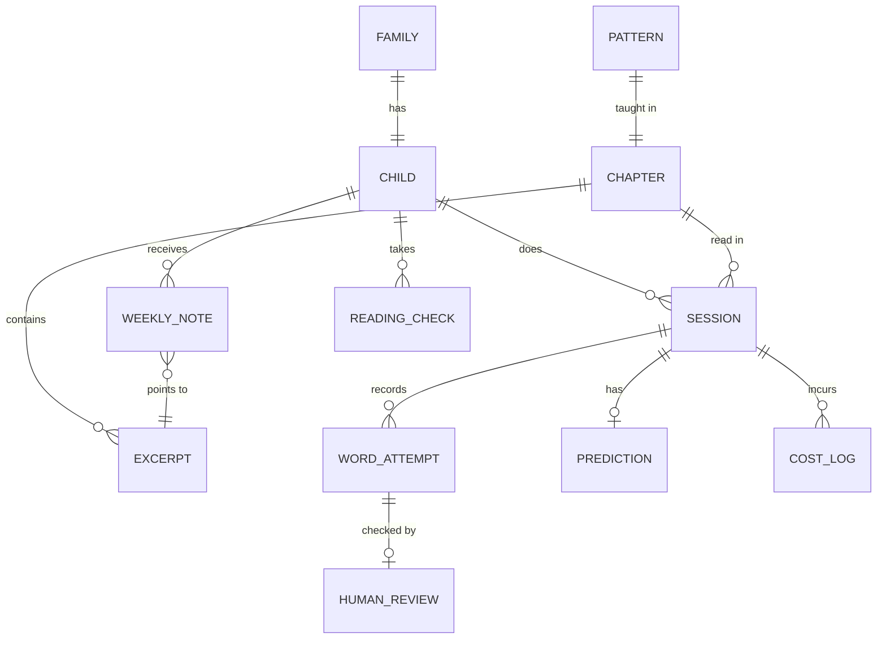

# Primer MVP: Data Model

2026-10-09 · Nishi · Status: draft, decisions resolved · Builds on [02-prd.md](02-prd.md) and [03-ux-flows.md](03-ux-flows.md)

This is a plain relational sketch, independent of any database product. The database choice is made in the technical design. Decisions DM1 to DM4 were settled on 2026-10-09 and are listed at the end.

## Principles

- Keep the minimum. The only per-child record is a first name, two life details and scores (S7), plus what the parent note and consent require.
- Content (patterns, chapters, excerpts) is fixed and shared. Everything per child references it by ID.
- Every word attempt is stored, because the first test question compares the app to a human listener word by word.
- Audio is not a table. It is a temporary file, deleted after scoring unless the family opted in.

## Entity relationship diagram

## Entities

### Family
The parent's signup. One per child in the MVP.

| Field | Notes |
| --- | --- |
| id | |
| contact_channel | text or email |
| contact_value | phone number or email address |
| consent_at | when the parent agreed to the privacy note |
| keep_audio | true only if the parent opted in |

### Child
| Field | Notes |
| --- | --- |
| id | |
| family_id | |
| first_name | |
| pet_name | life detail 1, fixed prompt |
| fear | life detail 2, fixed prompt |
| link_token | random, unguessable, identifies the child in the private link |
| created_at | |

### Pattern (curriculum table, in code)
| Field | Notes |
| --- | --- |
| id | 1 to 16, defines the order |
| name | e.g. short a, "sh" |
| sight_words | allowed sight words at this step, cumulative |

### Chapter (content, fixed)
| Field | Notes |
| --- | --- |
| id | 1 to 16, one per pattern |
| pattern_id | |
| text_template | chapter text with slots for pet name and fear |
| word_count | 60 to 120, checked by the decodability script |
| reviewed_by / reviewed_at | human read before any child sees it |

### Excerpt (content, fixed)
The page the parent reads together. Linked from the weekly note.

| Field | Notes |
| --- | --- |
| id | |
| chapter_id | |
| pattern_id | pattern this excerpt exercises, so the note can choose by shaky pattern |
| text_template | |

### Session
| Field | Notes |
| --- | --- |
| id | |
| child_id | |
| chapter_id | |
| date | one per child per day, enforced |
| status | in progress, completed |
| resume_word_index | last word reached, for resuming |
| noise_flag | set when the operator should check the recording |
| started_at / completed_at | |

Completed means the chapter is finished and the prediction question is answered.

### WordAttempt
One row per word in the chapter, per session.

| Field | Notes |
| --- | --- |
| id | |
| session_id | |
| word_index | position in the chapter |
| expected_word | |
| heard_word | what the speech service returned, or empty if skipped |
| outcome | correct, wrong, skipped |
| ladder_rung | 0 if no help; 1 to 3 for the highest rung reached |
| start_ms / end_ms | timing from the speech service |

A word that reached any rung counts as not correct for the scoring.

### Prediction
| Field | Notes |
| --- | --- |
| id | |
| session_id | |
| transcript | text kept for the parent |

The audio clip is deleted after transcription unless the family opted in.

### HumanReview (for the first three families)
| Field | Notes |
| --- | --- |
| id | |
| word_attempt_id | |
| human_outcome | correct, wrong, skipped |
| reviewer | |
| reviewed_at | |

Agreement is computed by comparing outcome to human_outcome across all reviewed words.

### WeeklyNote
| Field | Notes |
| --- | --- |
| id | |
| child_id | |
| week_number | 1 to 4 |
| solid_patterns | list of pattern IDs |
| shaky_patterns | list of pattern IDs |
| excerpt_id | the page to read together |
| summary_line | model-written one line |
| excerpt_token | random token for the excerpt link, separate from the child's link_token |
| sent_at | |
| opened_at | set when the parent opens the link |
| page_read_at | set when the parent taps "We read it together" on the excerpt page |

### ReadingCheck (by hand)
| Field | Notes |
| --- | --- |
| id | |
| child_id | |
| week | 0 or 4 |
| oral_reading_score | |
| made_up_word_score | |
| scored_by | |

### CostLog
| Field | Notes |
| --- | --- |
| id | |
| session_id | |
| kind | speech, transcription, model, message; one row per API call |
| amount | cost in dollars |
| created_at | |

## Retention

| Data | Kept | Deleted |
| --- | --- | --- |
| Reading audio | only if keep_audio is true | right after scoring otherwise |
| Prediction audio | only if keep_audio is true | right after transcription otherwise |
| Transcript, word attempts, scores | for the pilot | decided in the technical design |
| Parent contact | for the pilot | decided in the technical design |

## Design decisions

| # | Decision |
| --- | --- |
| DM1 | Separate tokens: one per child link, one per note excerpt link |
| DM2 | Two columns on Child: pet_name and fear |
| DM3 | CostLog has one row per API call; sessions sum their rows |
| DM4 | Excerpt page has a "We read it together" button; opened_at and page_read_at come from it |

## Follow-ups for later documents

- **UX flows:** the excerpt page needs the "We read it together" button, which is not yet drawn as a screen.
- **Technical design:** retention periods for transcripts, scores and parent contact; where audio is held between recording and scoring; revocation of keep_audio.
