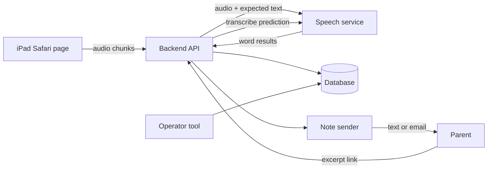

# Primer MVP: Technical Design

2026-10-09 · Nishi · Status: draft, choices made · Builds on [02-prd.md](02-prd.md), [03-ux-flows.md](03-ux-flows.md) and [04-data-model.md](04-data-model.md)

Each choice section lists options, then records the decision made on 2026-10-09 (TD1 to TD6, summarized at the end). Vendor features and prices below come from general knowledge and must be checked before committing.

## Goals and constraints

- One person builds it in about two weeks.
- iPad with Safari only. Microphone capture in Safari is the main browser risk.
- Ten families, so scale does not matter; simplicity and cost visibility do.
- Children's voices and names are involved, so privacy choices are conservative by default.

## Architecture

Data flow for one session: the page loads a chapter for the child's token, records the microphone, and sends audio to the backend. The backend asks the speech service to match the audio against the known chapter text and returns word outcomes, which the page uses to highlight words and run the hint ladder. Outcomes are saved as WordAttempt rows. Audio is deleted after scoring unless the family opted in.

## Fixed by the MVP (no choice needed)

| Area | Design |
| --- | --- |
| Curriculum | Plain table in code listing 16 patterns in order, with sight words per step. The model never chooses the lesson. |
| Chapters | Drafted once by a language model, filtered by the decodability script, then read by a human. Stored as templates with slots for pet name and fear. |
| Decodability script | Runs over every sentence; rejects any word using an untaught pattern or non-listed sight word. |
| Parent note | Template fills solid and shaky patterns from scores; the model writes only the one-line summary; the operator reviews before sending. |
| Access | No logins. Each child has a private token link, and each note has its own excerpt token. |
| Language and device | English, iPad Safari. |

## Choice 1: Front end

The page shows text, records the microphone, highlights words and runs the ladder timers.

| Option | Pros | Cons |
| --- | --- | --- |
| A. Plain HTML + vanilla JS | Nothing to build or update; fewest moving parts for a single screen flow | State handling gets hand-rolled; messier as screens grow |
| B. Small framework (React or similar) with Vite | Familiar component model; easy to build the many screen states | A build step; more to learn if unfamiliar |
| C. Server-rendered pages with a little JS | Simple deploy; signup and note pages come free | Real-time highlighting still needs JS anyway |

Recommendation: **B**, because the reading screen has several states (ready, listening, ladder rungs, done, resume) and benefits from components. Choose A if you want zero tooling.

**Decision (TD1): B**, a small framework with Vite.

## Choice 2: Speech scoring

The expected text is known, so the job is matching timings to words. This decision matters most: the whole first research question rests on it.

| Option | Pros | Cons |
| --- | --- | --- |
| A. General speech-to-text with word timings (such as Deepgram, AssemblyAI, Google, OpenAI) | Cheap, easy streaming; you align returned words to the chapter yourself | Models tend to correct mispronunciations into the "right" word, which hides errors; children's speech accuracy varies |
| B. Pronunciation-assessment service that takes reference text (such as Azure Speech pronunciation assessment) | Built for this: per-word scores against reference text | Scores are tuned for language learners, and quality on 5 to 7 year olds is unproven; cloud-vendor setup |
| C. Open-source model (such as Whisper) run on your own server | Full control and word timestamps; no per-minute vendor cost | You host and tune it; slower; the same autocorrect problem as A |

Recommendation: start with **A**, aligned to the chapter text, and measure agreement against the human listener (as the MVP plans). Run **B** in parallel on the first three families' recordings as a comparison, since it is cheap to test.

**Decision (TD2): A**, general speech-to-text aligned to the chapter text, with B trialed on the first three families' recordings.

## Choice 3: Hosting and database

| Option | Pros | Cons |
| --- | --- | --- |
| A. Single small server (one app, SQLite or Postgres) | Cheapest and simplest; one place to look; easy deletion of audio | You manage the server and backups |
| B. Backend-as-a-service (such as Supabase or Firebase) | Database, file storage and scheduled jobs included | Data sits on a third-party platform; more settings for children's data |
| C. Serverless functions plus a managed database | Little server upkeep; cheap at low use | More pieces; long audio uploads and timeouts to manage |

Recommendation was **A** for ten families. Scalability was the deciding question, since A scales least and B grows past the pilot with no extra work.

**Decision (TD3): B**, a backend-as-a-service. Consequences:
- The platform's database, file storage and scheduled jobs replace the server. Platform choice (Supabase, Firebase or similar) is made at build time.
- Children's data sits on a third-party platform, so choose a region deliberately, turn on row-level access rules, keep the storage bucket for opted-in audio private, and enable the platform's backups.
- Temporary audio between recording and scoring goes in a private bucket with a short expiry, plus a scheduled job that deletes anything older than the scoring window.

## Choice 4: Note and link delivery

Parents chose text or email in the PRD (Q6), so both channels are needed.

| Option | Pros | Cons |
| --- | --- | --- |
| A. Email provider plus an SMS provider, both through scripts | Matches the PRD; automated | Two vendors; SMS needs phone consent and sender registration, which can take time |
| B. Email through a script, SMS sent by hand by the operator | No SMS vendor or registration for ten families | Manual, and the operator's own phone number is in use |
| C. Both sent by hand | Zero integration | Easy to forget; harder to log sent_at and opens |

Recommendation was **B**, to avoid SMS registration delays.

**Decision (TD4): A**, email and SMS both sent by script. Consequences:
- Start SMS sender registration immediately, since it can take days to weeks and could delay the pilot.
- Signup must collect explicit consent for texts.
- Each send writes sent_at; link clicks write opened_at.
- Keep manual sending as a fallback if registration is not ready for the first families.

## Choice 5: Prediction answer transcription

The PRD requires a text transcript of the child's answer, with the clip deleted afterward.

| Option | Pros | Cons |
| --- | --- | --- |
| A. Same speech service as Choice 2 | One vendor; one cost line | Free speech quality for a child may be rough |
| B. A separate stronger transcription model | Possibly better for open speech | Second vendor and second cost line |
| C. Operator transcribes by hand for week 1 families, then switch | Highest accuracy at first | Not automatic |

Recommendation: **A**, and treat transcripts as approximate in the note ("what Sam seems to say").

**Decision (TD5): A**, the same speech service as scoring.

## Privacy and data handling

- Audio is held only in temporary storage between recording and scoring, then deleted. Families with keep_audio true have audio stored separately.
- Connections use HTTPS only. Tokens are long and random. A missing or wrong token returns the same plain error page.
- Audio sent to a speech vendor should use settings that do not retain or train on it, where the vendor offers that. Verify per vendor.
- A parent consent screen at signup states what is kept and for how long. The PRD defers retention periods to this document: **proposal** is to delete scores, transcripts and contact details a set number of days after the pilot ends. **Decision (TD6): 90 days** after the pilot ends, then delete scores, transcripts and parent contact details. The PRD's audio opt-in can be revoked by the parent at any time, which deletes stored audio immediately.
- COPPA and similar rules may apply to a pilot with children under 13. Confirm requirements before recruiting anyone beyond friends and family.

## Operator tools

- A minimal page or script to list sessions, play audio for the first three families, mark each word correct, wrong or skipped, and compute agreement.
- A script to compute weekly solid and shaky patterns and draft the note.
- A cost view summing CostLog by child and day.

## Measuring scoring agreement

For each reviewed word, record the app outcome (WordAttempt.outcome) and the human outcome (HumanReview.human_outcome). Agreement is the share of words where they match. Break it down by age and accent group to check that no group is clearly worse. If agreement is below the Brief's threshold, change the scoring approach before building more.

## Deployment

One deployment with HTTPS, environment variables for keys, and a daily database backup. No staging environment.

## Risks

| Risk | Mitigation |
| --- | --- |
| Safari microphone permission or audio format quirks | Test on a real iPad on day one |
| Speech service autocorrects a child's mispronunciation | Measure against the human listener; trial the pronunciation-assessment option |
| Latency makes the ladder timing feel off | Keep the 3-second timings tunable; test on a real connection |
| SMS registration delays | Start registration first; send by hand as a fallback |
| Cost per child per day is too high | CostLog per call from session one |
| Child data exposure | Minimal data, 90-day retention, private storage, row-level access rules, conservative vendor settings |

## Decisions

| # | Decision |
| --- | --- |
| TD1 | Front end: small framework with Vite |
| TD2 | Speech scoring: general speech-to-text aligned to chapter text; pronunciation-assessment trial on first 3 families |
| TD3 | Hosting and database: backend-as-a-service |
| TD4 | Delivery: email and SMS both by script |
| TD5 | Prediction transcription: same service as scoring |
| TD6 | Retention: 90 days after the pilot ends |

## Follow-ups

- Add the excerpt page and its "We read it together" button as a screen in [03-ux-flows.md](03-ux-flows.md).
- Pick the exact backend platform, speech vendor, email provider and SMS provider when the build starts, and verify prices and children's-data terms for each.
- Confirm COPPA and consent requirements before recruiting beyond friends and family.
